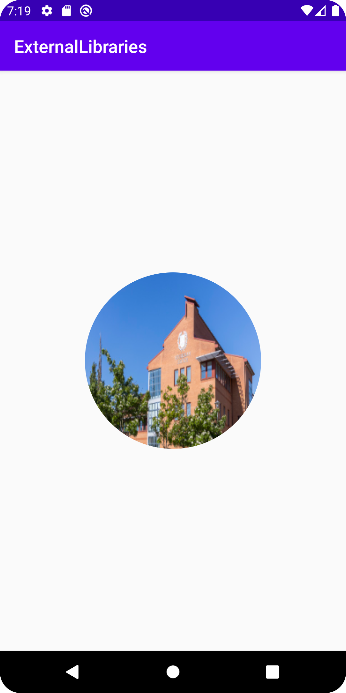

# Rapport Assignment 8: External libraries

**Använda Blibliotek**

Två bibliotek användes i detta arbete, Först används __Picasso__, biblioteket gör det möjligt att importera bilder via URL:er och implementera dem.
Det andra biblioteket som används är __circleimageview__, denna förenklar skapandet av runda bilder.

Det första steget är att tillåta åtkomst till internet från appen vilket vi gör som bekant i manifest-filen, sedan implementeras biblioteken, detta görs i Build.gradel filen genom koden nedan.

```java
dependencies {
    implementation fileTree(dir: 'libs', include: ['*.jar'])
    implementation 'androidx.appcompat:appcompat:1.1.0'
    implementation 'androidx.constraintlayout:constraintlayout:1.1.3'
    implementation 'com.squareup.picasso:picasso:2.71828'                   // <<---     Dessa två rader
    implementation  'de.hdodenhof:circleimageview:3.1.0'                    // <<--- 
    testImplementation 'junit:junit:4.12'
    androidTestImplementation 'androidx.test.ext:junit:1.1.1'
    androidTestImplementation 'androidx.test.espresso:espresso-core:3.2.0'
}

```

Med biblioteken implementerade kvarstår användandet av dem. För detta projekt kommer en rund bild skapas, hämtat från en URL.  
Arbetet börjar i `activity_main.xml`, notera att `<de.hdodenhof.circleimageview.CircleImageView/>` används istället för det vanliga `<ImageView/>`, här används CircleImageView biblioteket!


````xml
<de.hdodenhof.circleimageview.CircleImageView           
        android:id="@+id/picasso_image"
        android:layout_width="200dp"
        android:layout_height="200dp"
        app:layout_constraintStart_toStartOf="parent"
        app:layout_constraintEnd_toEndOf="parent"
        app:layout_constraintTop_toTopOf="parent"
        app:layout_constraintBottom_toBottomOf="parent"
        />
````

Kvarstår nu att implementera bilden i `MainActivity.java`, notera att det fortfarande är en vanlig ImageView som skapas. Biblioteket __Picasso__ används längst ner i koden. Där ser man att den hämtar en bild via en URL, ändrar storleken på bilden och sist skickar den till den skapade imageViewn.

````java
public class MainActivity extends AppCompatActivity {

    ImageView imageView;                // <-- 


    @Override
    protected void onCreate(Bundle savedInstanceState) {
        super.onCreate(savedInstanceState);
        setContentView(R.layout.activity_main);

        imageView = findViewById(R.id.picasso_image);      // <--- 

        Picasso.get().load("https://www.his.se/contentassets/df34584991724cd3be379489759a3d7c/_hor98703.jpg").resize(200, 200).into(imageView);  //<<<--- 
    }
}
````
Tillsammans skapar de då den runda bilden som kan se i exempelbilden nedan!

